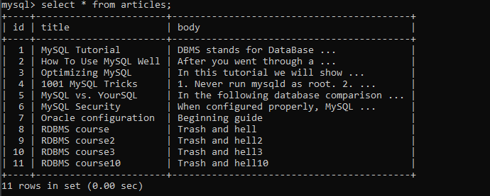

# ДЗ 15. Восстановление из бэкапа в MySQL

Создаём докер-контейнер и подключаемся к нему. (`D:\otus-dbms\backup-data` - это директория на моей машине, где лежат исходные данные.)

```
docker run --name mysql -d -i -e MYSQL_ALLOW_EMPTY_PASSWORD=yes -v D:/otus-dbms/backup-data:/data mysql:8.0.24
docker exec -it mysql bash
```

Устанавливаем в контейнер Percona Xtrabackup:
```
apt-get update && apt-get install -y lsb-release wget curl
wget https://repo.percona.com/apt/percona-release_latest.$(lsb_release -sc)_all.deb
dpkg -i percona-release_latest.$(lsb_release -sc)_all.deb
apt-get update
percona-release enable-only tools
apt-get update && apt-get install -y percona-xtrabackup-24
```

Заходим в mysql, создаём БД и выходим.
```
CREATE DATABASE otus;
```

Импортируем структуру БД:
```
mysql -p otus < /data/otus_db-4560-3521f1.dmp
```

Расшифровываем и разархивируем бэкап:
```
openssl des3 -salt -k "password" -d -md md5 -in /data/backup.xbstream.gz-4560-0d8b3a.des3 -out /data/backup.xbstream.gz
gzip -d /data/backup.xbstream.gz
```

Извлекаем файлы из файла потока:
```
cd /home
xbstream -x < /data/backup.xbstream
```

Заходим в mysql, делаем для интересующей нас таблицы discard tablespace и выходим:
```
use otus;
ALTER TABLE articles DISCARD TABLESPACE;
```

Копируем нужный файл и меняем права:
```
cd otus;
cp articles.ibd /var/lib/mysql/otus
cd /var/lib/mysql/otus
chown mysql:mysql articles.ibd
```

Заходим в mysql, импортируем tablespace и получаем результат:
```
use otus;
ALTER TABLE articles IMPORT TABLESPACE;
select * from articles;
```

