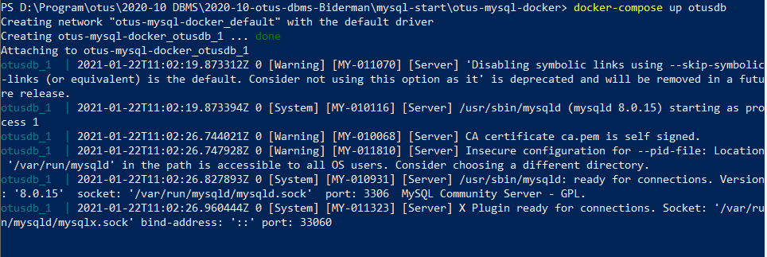
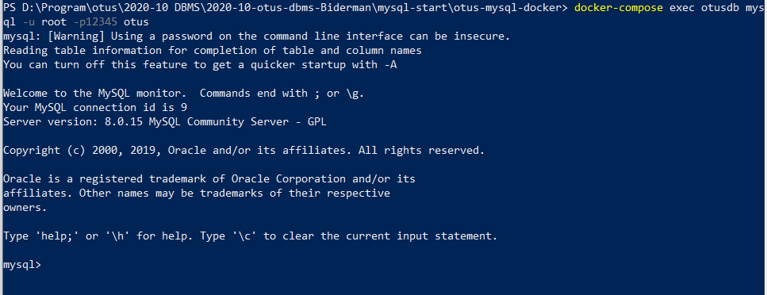
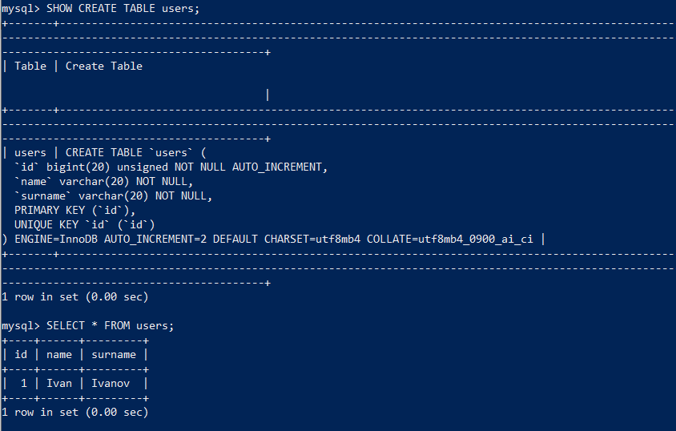
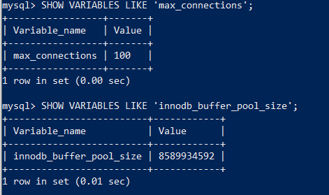
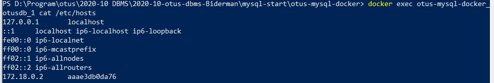

# ДЗ 7: Создать базу данных MySQL в докере
Я внёс изменения в файл `init.sql` (скрипт создания БД) и `custom.conf/my.cnf` (изменение настроек БД) в поддиректории `otus-mysql-docker` . Файл `custom.conf/my.cnf` я сделал read-only (у меня Windows).

Запуск базы данных:
`docker-compose up otusdb`


Подключение к БД:
`docker-compose exec otusdb mysql -u root -p12345 otus`


Проверка, что правильно отработал скрипт создания БД:
`SHOW CREATE TABLE users;`
`SELECT * FROM users;`


Проверка, что подцепились настройки:
`SHOW VARIABLES LIKE 'max_connections';`;
`SHOW VARIABLES LIKE 'innodb_buffer_pool_size';`;


Создание схемы и пользователя для сисбенча:
```
CREATE SCHEMA sbtest;
CREATE USER sbtest@'%' IDENTIFIED BY 'password';
GRANT ALL PRIVILEGES ON sbtest.* to sbtest@'%';
```

Чтобы узнать IP адрес контейнера, выхожу из mysql и запускаю команду:
`docker exec otus-mysql-docker_otusdb_1 cat /etc/hosts`


Sysbench - подготовка:
`docker run --network=otus-mysql-docker_default --rm=true --name=sb-prepare severalnines/sysbench sysbench --db-driver=mysql --oltp-table-size=100000 --oltp-tables-count=24 --threads=1 --mysql-host=172.18.0.2 --mysql-port=3306 --mysql-user=sbtest --mysql-password=password /usr/share/sysbench/tests/include/oltp_legacy/parallel_prepare.lua run`

Результаты:
```
SQL statistics:
    queries performed:
        read:                            0
        write:                           912
        other:                           48
        total:                           960
    transactions:                        1      (0.01 per sec.)
    queries:                             960    (11.59 per sec.)
    ignored errors:                      0      (0.00 per sec.)
    reconnects:                          0      (0.00 per sec.)

General statistics:
    total time:                          82.8279s
    total number of events:              1

Latency (ms):
         min:                                82826.77
         avg:                                82826.77
         max:                                82826.77
         95th percentile:                    83521.57
         sum:                                82826.77

Threads fairness:
    events (avg/stddev):           1.0000/0.00
    execution time (avg/stddev):   82.8268/0.00
```

Sysbench - запуск
`docker run --network=otus-mysql-docker_default --name=sb-run severalnines/sysbench sysbench --db-driver=mysql --report-interval=2 --mysql-table-engine=innodb --oltp-table-size=100000 --oltp-tables-count=24 --threads=64 --time=20 --mysql-host=172.18.0.2 --mysql-port=3306 --mysql-user=sbtest --mysql-password=password /usr/share/sysbench/tests/include/oltp_legacy/oltp.lua run`

Результаты:
```
SQL statistics:
    queries performed:
        read:                            136668
        write:                           39048
        other:                           19524
        total:                           195240
    transactions:                        9762   (486.91 per sec.)
    queries:                             195240 (9738.21 per sec.)
    ignored errors:                      0      (0.00 per sec.)
    reconnects:                          0      (0.00 per sec.)

General statistics:
    total time:                          20.0471s
    total number of events:              9762

Latency (ms):
         min:                                   28.63
         avg:                                  131.25
         max:                                  662.45
         95th percentile:                      223.34
         sum:                              1281305.81

Threads fairness:
    events (avg/stddev):           152.5312/4.54
    execution time (avg/stddev):   20.0204/0.01
```
