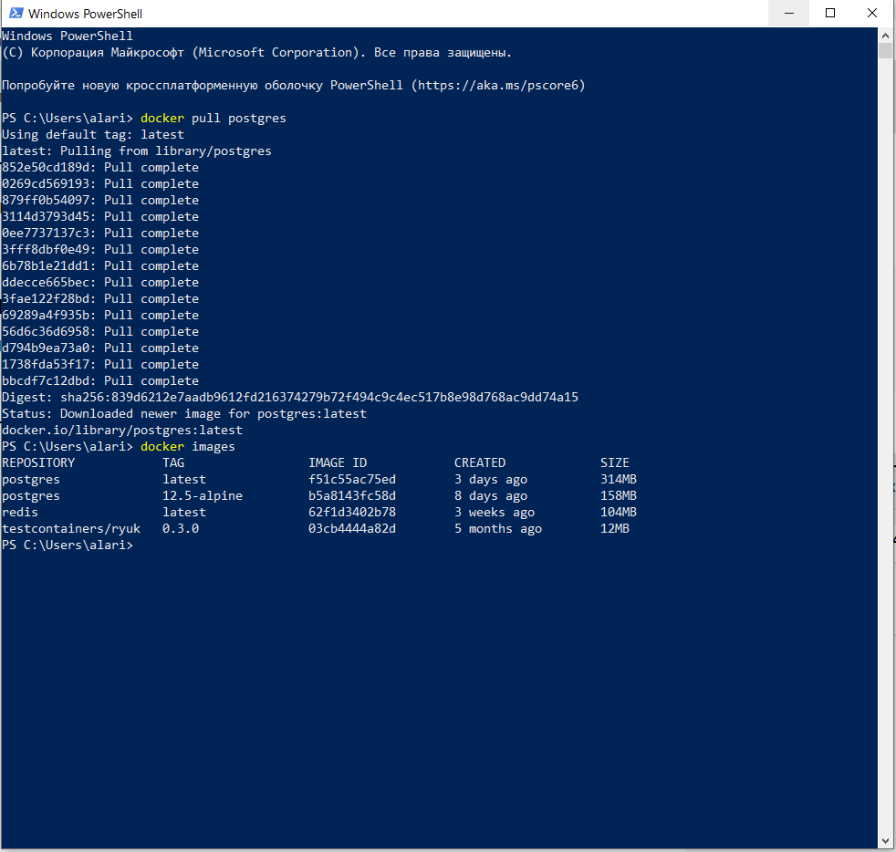
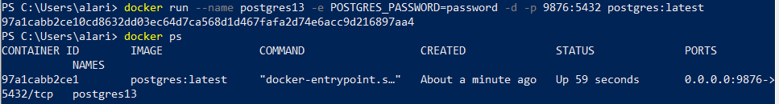
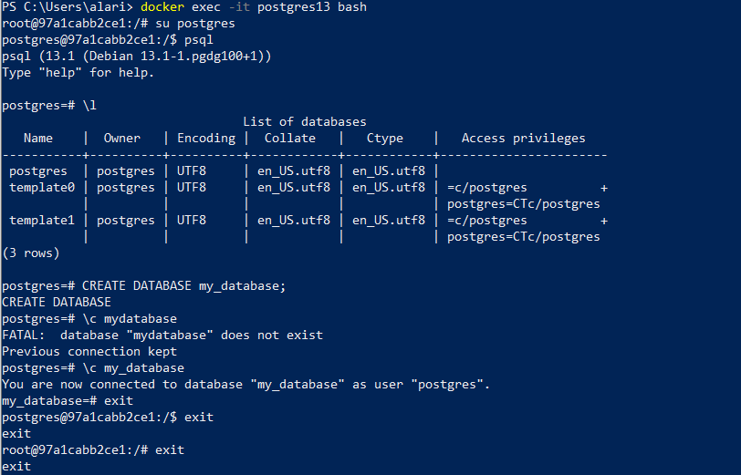
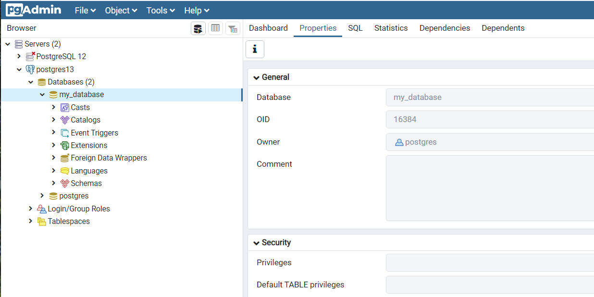
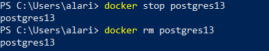

# Подключение к PostgreSQL в докере

## Скачивание контейнера

```
docker pull postgres
docker images
```


## Запуск

```
docker run --name postgres13 -e POSTGRES_PASSWORD=password -d -p 9876:5432 postgres:latest
```

Я использовал другой порт, потому что у меня на машине установлен PostgreSQL (не из докера) и стандартный порт занят.

```
docker ps
```



## Локальное подключение и операции с БД

Запуск локального подключения в контейнере, просмотр имеющихся БД, создание новой, подключение к ней, выход.
```
docker exec -it postgres13 bash

\l
CREATE DATABASE my_database;
\c my_database
exit
```



## Подключение через pgAdmin



## Остановка и удаление контейнера

```
docker stop postgres13
docker rm postgres13    
```

