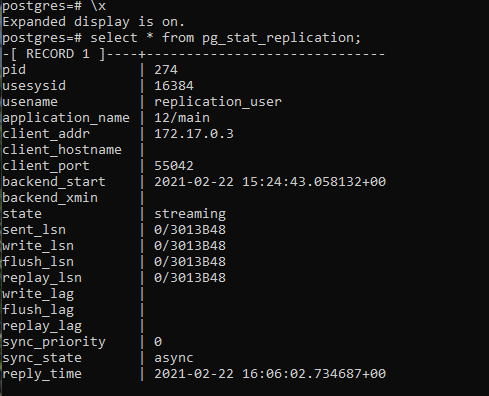
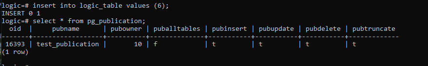
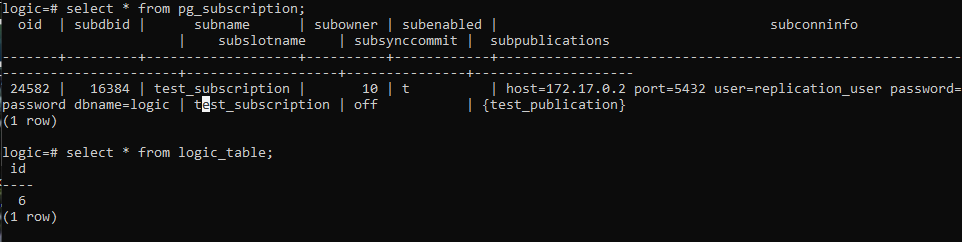

# ДЗ 6: Репликация в PostgreSQL

У меня не получилось запустить репликацию на стандартных postgres'овских контейнерах (я так и не понял, как удалить директорию с данными, не уронив при этом контейнер), поэтому я сделал себе контейнеры с PostgreSQL на основе контейнеров Ubuntu. Dockerfile приложен.

Сборка образа:
```
docker build --tag ubuntu_with_postgres .
```

## Физическая репликация

### Настройка мастера

Запуск контейнера для мастера, подключение к нему и настройка:
```
docker run --name postgres_primary -e POSTGRES_PASSWORD=password -d -i -p 6000:5432 ubuntu_with_postgres
docker exec -it postgres_primary bash
cd /etc/postgresql/12/main
```

Редактирую pg_hba.conf: `nano pg_hba.conf`. Вставляю строчку: `host    replication    replication_user    172.17.0.*/24    md5`.

Редактирую postgresql.conf: `nano postgresql.conf`. Редактирую строчку: `listen_addresses = '*'`.

Запускаю postgres и вхожу в БД:

```
su postgres
service postgresql start
psql
```

Создание пользователя:
```
CREATE ROLE replication_user WITH LOGIN REPLICATION PASSWORD 'password'; 
```

Создание слота для репликации:
```
SELECT * FROM pg_create_physical_replication_slot('replica_slot');
```

### Настройка реплики

Запуск и подключение:

```
docker run --name postgres_replica -e POSTGRES_PASSWORD=password -d -i -p 7000:5432 ubuntu_with_postgres 
docker exec -it postgres_replica bash
```

Удаление директории с данными и запуск репликации:
```
su postgres
cd $PGDATA
rm -rf 12
pg_basebackup -h 172.17.0.2 -U replication_user -p 5432 -D /var/lib/postgresql/12/main -Fp -Xs -P -R --slot replica_slot
```

Редактирую postgresql.conf: `nano postgresql.conf`. Редактирую строчку: `recovery_min_apply_delay = 5min`.

### Проверка

Создаю на мастере тестовую БД с таблицей:
```
create database test;
CREATE TABLE test_table (id int);
insert into test_table values (5);
```

И убеждаюсь, что через пять минут эти данные пришли на реплику.

```select * from pg_stat_replication;```


На реплике:
```select * from pg_stat_wal_receiver;```


## Логическая репликация

На мастере выхожу из БД и редактирую postgresql.conf: `nano postgresql.conf`. Редактирую строчку: `wal_level = logical`.

Перезапускаю сервер: `service postgresql restart`.

Захожу в базу: `psql`.

Создаю новую базу данных, подписку и публикацию:
```
CREATE DATABASE logic;
\c logic
CREATE TABLE logic_table(id int);
CREATE PUBLICATION test_publication FOR TABLE logic_table;
```

Выдаю права на чтение таблицы пользователю для репликации:
```
grant select on logic_table TO replication_user;
```

Выхожу из БД и вставляю строчку в pg_hba.conf: `host    logic    replication_user    172.17.0.*/24    md5`, после чего опять перезапускаю postgres.


Создаю инстанс для логической репликации и захожу в него:

```
docker run --name postgres_logrep -e POSTGRES_PASSWORD=password -d -i -p 8000:5432 ubuntu_with_postgres
docker exec -it postgres_logrep bash
```

Запускаю postgres и вхожу в БД:

```
su postgres
service postgresql start
psql
```

Создаю БД, таблицу и подписку:
```
CREATE DATABASE logic;
\c logic
CREATE TABLE logic_table(id int);
CREATE SUBSCRIPTION test_subscription CONNECTION 'host=172.17.0.2 port=5432 user=replication_user password=password dbname=logic' PUBLICATION test_publication;
```

Для проверки на мастере вхожу в БД.

```
\c logic
insert into logic values (6);
select * from pg_publication;
```



На реплике:
```
select * from pg_subscription;
select * from logic_table;
```

