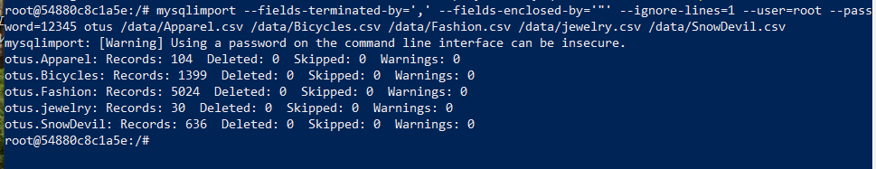

# ДЗ 10. Транзакции. Часть 2. Загрузка данных

Для создания БД я использую конфигурацию для docker-compose из ДЗ 7 (директория `otus-mysql-docker`). В скрипте `init.sql` я создаю таблицы, в которых будут импортированы данные. В конфигурации я подключаю директорию с csv-файлами, а в конфигурационном файле `custom.conf/my.cnf` передаю директорию, в которую будут смонтированы csv-файлы, в параметр `secure_file_priv`.

## Загрузка через load data

Запускаю конфигурацию в докере:

`docker-compose up otusdb`

Подключаюсь к БД:

`docker-compose exec otusdb mysql -u root -p12345 otus`

Загружаю данные:

```
LOAD DATA INFILE '/data/Apparel.csv' INTO TABLE Apparel
    FIELDS TERMINATED BY ',' ENCLOSED BY '"'
    IGNORE 1 LINES;    
```

Проверка:
```
SELECT COUNT(*) FROM apparel;
```


Остальные файлы загружаются аналогично (нужно менять лишь имя файла и имя таблицы).

## Загрузка через mysqlimport

Очистка конфигурации в докере и перезапуск.
```
docker-compose rm otusdb
docker-compose up otusdb
```

Заход в контейнер через bash:
```
docker-compose exec otusdb bash
```

Импорт: 
```
mysqlimport --fields-terminated-by=',' --fields-enclosed-by='"' --ignore-lines=1 --user=root --password=12345 otus /data/Apparel.csv /data/Bicycles.csv /data/Fashion.csv /data/jewelry.csv /data/SnowDevil.csv
```

